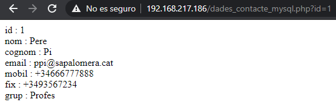
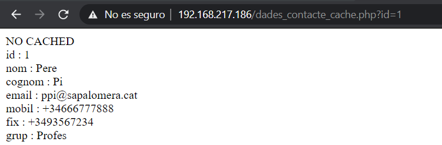
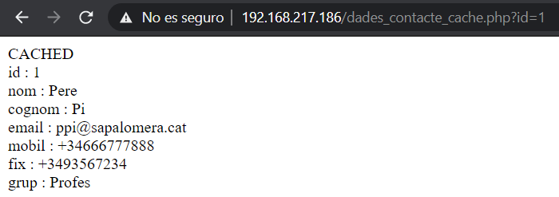

# Base de dades Memcache i MySQL
Aquest repositori mostra com fer servir una base de dades NoSQL com a cache per a un MySQL en PHP.

Per crear la base de dades en MySQL hem fet serfir les seguents [sentencies](./sentencies_sql.md).

# Exemple de access a MySQL amb PHP
Podem executar el script [dades_contacte_mysql.php](./public/dades_contacte_mysql.php) i ens mostrara l'usuari introduit en la url. Per exemple 
```
localhost/dades_contacte_mysql.php?id=1
```
ens mostrara la seguent pagina



# Netejar cache de Memcached
```
echo 'flush_all' | nc localhost 11211
```
# Exemple de access a MySQL amb PHP a traves de Memcache
Podem executar el script [dades_contacte_cache.php](./public/dades_contacte_mysql.php) i ens mostrara l'usuari introduit en la url. Per exemple, si s'executa
```
localhost/dades_contacte_cache.php?id=1
```
per primera vegada, no tindra, cache i mostrara aixo.



Si la segona execucio está dintre del periode de vida de la cache (configurada a 20s en el fitxer [php](./public/dades_contacte_cache.php)), es mostrara aquesta altra.



